# class

- blueprint for a class used to make objects

has the following

- name
- attributes (states)
- methods (behaviors)
- a constructor. used to init the attributes.

# object

- instance of a class that represents a real world entity, encapsulates data and methods together.

# constructor

- used to instantiate an object of a class.

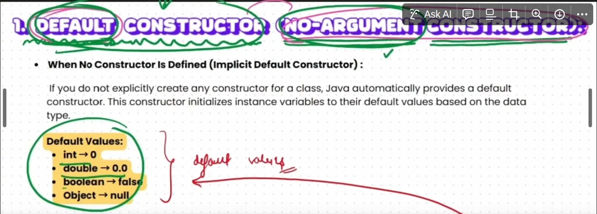

- default constructor can be custom as well.

## parameterised constructors

takes in parameters to initialize the attributes of the class.

## copy constructor

- used to create a new object as a copy of an existing object.
- copy of an already existing object.

```cpp
class Student {
    public:
        int age;
        string name;

        // default constructor
        Student() {
            age = 0;
            name = "Unknown";
        }

        // parameterized constructor
        Student(int a, string n) {
            age = a;
            name = n;
        }

        // copy constructor
        Student(const Student &s) {
            age = s.age;
            name = s.name;
        }
};
```

## private constructor

- used to restrict the instantiation of a class to within the class itself.
- restricts the creation of objects from outside the class.

### singleton class

- a class that allows only one instance to be created.

```cpp
class Singleton {
    private:
        static Singleton *instance;
        Singleton() {} // private constructor

    public:
        static Singleton *getInstance() {
            if (!instance) {
                instance = new Singleton(); // create instance if it doesn't exist
            }
            return instance;
        }
};
```

# shallow copy vs deep copy

- **Shallow Copy**: Copies the values of the object's attributes, but does not create copies of objects that are referenced by those attributes. Changes to mutable objects in the original will affect the copy.
- **Deep Copy**: Creates a new object and recursively copies all objects referenced by the original object. Changes to mutable objects in the original will not affect the copy.

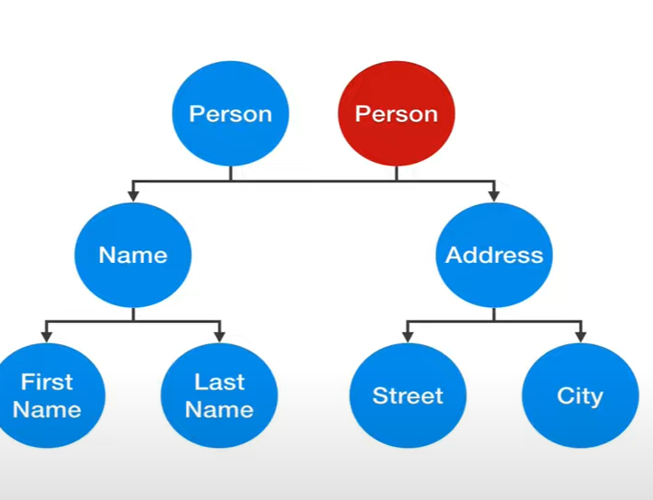
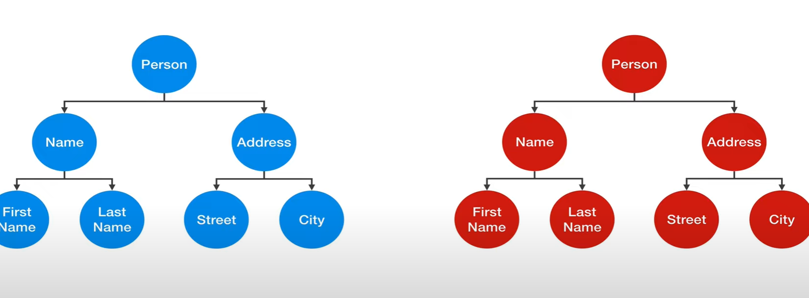

```cpp
class ShallowCopy {
    public:
        int *data;

        ShallowCopy(int value) {
            data = new int(value);
        }

        // Shallow copy constructor
        ShallowCopy(const ShallowCopy &sc) {
            data = sc.data; // points to the same memory location
        }

        ~ShallowCopy() {
            delete data; // will cause issues if multiple objects are deleted
        }
};

class DeepCopy {
    public:
        int *data;

        DeepCopy(int value) {
            data = new int(value);
        }

        // Deep copy constructor
        DeepCopy(const DeepCopy &dc) {
            data = new int(*dc.data); // creates a new memory location
        }

        ~DeepCopy() {
            delete data;
        }
};
```

## interview questions

- what happens if you define a constructor with paramenters explicitly and call the object without parameters?

  - it will give an error because the default constructor is not available anymore, once you define a constructor with parameters.

- order of constructor calls in inheritance in cpp, in various cases.
  - in single inheritance, the base class constructor is called first, followed by the derived class constructor.
  - in multiple inheritance, the base class constructors are called in the order they are inherited, followed by the derived class constructor.
  - if there are abstract classes in multiple inheritance, the constructors of the abstract classes are called first, followed by the derived class constructor.
- can constructors be synchronized?

  - no, constructors cannot be synchronized in java. synchronization is used to control access to a method or block of code by multiple threads, but constructors are not designed for this purpose.

- can a constructor have a return statement?
  - no, constructors do not have a return type, but they can have a return statement to return an object of the class.

# this keyword

- can be used for the following:
  - to refer to the current object.
  - to differentiate between instance variables and parameters with the same name.
  - to call another constructor in the same class (constructor chaining).
  - to return the current object from a method , allowing for method chaining.
  - to pass the current object as a parameter to another method or constructor.
- disadvantages
  - not used in static methods, as they do not belong to any instance

## method chaining

```cpp
class Chain {
    private:
        int value;
    public:
        Chain(int v) : value(v) {}
        Chain& setValue(int v) {
            value = v;
            return *this; // return the current object
        }
        void display() {
            cout << "Value: " << value << endl;
        }
};

int main() {
    Chain c(10);
    c.setValue(20).display(); // method chaining
    return 0;
}
```

# polymorphism

- the ability of an object to take on many forms.
- allows methods to do different things based on the object it is acting upon.

- can be achieved through:
  - method overloading
  - method overriding
  - operator overloading

## method overloading

- allows multiple methods with the same name but different parameters (type, number, or order)
- occurs at compile time (static polymorphism)

## method overriding

- allows a subclass to provide a specific implementation of a method that is already defined in its superclass
- occurs at runtime (dynamic polymorphism)
- the method in the subclass must have the same name, return type, and parameters as the method in the superclass
- the `virtual` keyword is used in the superclass to indicate that the method can be overridden in derived classes

### upcasting

- converting a derived class object to a base class reference or pointer
- allows access to base class methods, but not derived class methods

# inheritance

- established a 'is-a' relationship between classes

## single interitance

- a class (derived class) inherits from one base class

## multilevel inheritance

- a class inherits from another derived class, forming a chain of inheritance
- allows for a hierarchy of classes

## hierarchical inheritance

- multiple derived classes inherit from a single base class
- allows for code reuse and organization

## multiple inheritance

- a class inherits from multiple base classes
- allows a class to combine features from multiple classes
- not allowed in some languages (like Java) due to ambiguity issues, but supported in others (like C++)

# diamond problem

```cpp
class A {
    public:
        virtual void display() {
            cout << "Class A" << endl;
        }
};
class B : public A {
    public:
        void display() {
            cout << "Class B" << endl;
        }
};
class C : public A {
    public:
        void display() {
            cout << "Class C" << endl;
        }
};
class D : public B, public C {
    public:

};
int main() {
    D d;
    d.display(); // ambiguous call, which display() to call?
    // To resolve this, we can use scope resolution operator
    d.B::display(); // calls display() from class B
    d.C::display(); // calls display() from class C
    return 0;
}
```

### what is backward compatibility in default methods in interfaces?

- allows new methods to be added to an interface without breaking existing implementations
- existing classes that implement the interface will still work without modification, as they are not required to implement the new methods

### virtual destructors

- used to ensure that the destructor of the derived class is called when an object is deleted through a base class pointer

```cpp
class Base {
    public:
        virtual ~Base() {
            cout << "Base destructor called" << endl;
        }
};
class Derived : public Base {
    public:
        ~Derived() {
            cout << "Derived destructor called" << endl;
        }
};  
int main() {
    Base *b = new Derived();
    delete b; // calls Derived destructor first, then Base destructor
    return 0;
}
``` 

### virtual inheritance

- used to solve the diamond problem by ensuring that only one instance of the base class is created

```cpp
class A {
    public:
        virtual void display() {
            cout << "Class A" << endl;
        }
};
class B : virtual public A {
    public:
        void display() {
            cout << "Class B" << endl;
        }
};
class C : virtual public A {
    public:
        void display() {
            cout << "Class C" << endl;
        }
};
class D : public B, public C {
    public:
        void display() {
            cout << "Class D" << endl;
        }
};

int main() {
    D d;
    d.display(); // calls display() from class D
    d.B::display(); // calls display() from class B
    d.C::display(); // calls display() from class C
    return 0;
}
```

### in java interface is used to achieve multiple inheritance

## advantages of inheritance
- code reusability
- method overriding
- extensibility
- support for polymorphism

## disadvantages of inheritance
- tight coupling between base and derived classes
 - what is coupling?
   - the degree of interdependence between software modules.
   - if we change something in one module, itll break the other module.

# encapsulation
- the bundling of data and methods that operate on that data within a single unit (class)
- restricts direct access to some of an object's components, which is a means of preventing unintended misuse of the data
- achieved through access modifiers (public, private, protected)

## data hiding
- prevents external direct access to the internal state of an object
## modularity
- separates data from methods, allowing for better organization and management of code
## security
- protects the integrity of code. 
## flexibility
- allows for changes to the internal implementation without affecting external code that uses the class


# abstraction
- Abstraction is a fundamental concept in object-oriented programming that focuses on exposing only the relevant details of an object while hiding its internal complexities. 
- Abstraction improves maintainability, enables code reusability, and makes systems easier to understand and extend.
- achieved through abstract classes and interfaces
## advantages of abstraction
- simplifies complex systems by breaking them down into manageable parts
- allows for easier maintenance and updates
- promotes code reusability and modularity
- enhances security by hiding implementation details
## disadvantages of abstraction
- can lead to increased complexity if not designed properly
- needs careful planning

# interface
- why is it better than abstract class?
  - an interface can be implemented by multiple classes, allowing for multiple inheritance.
  - an abstract class can only be extended by one class, limiting its reusability.
- an interface can have only abstract methods, while an abstract class can have both abstract and concrete methods

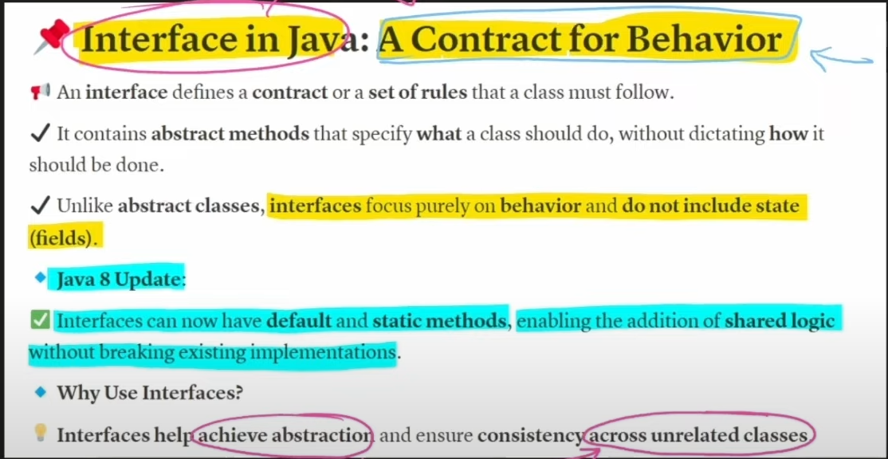
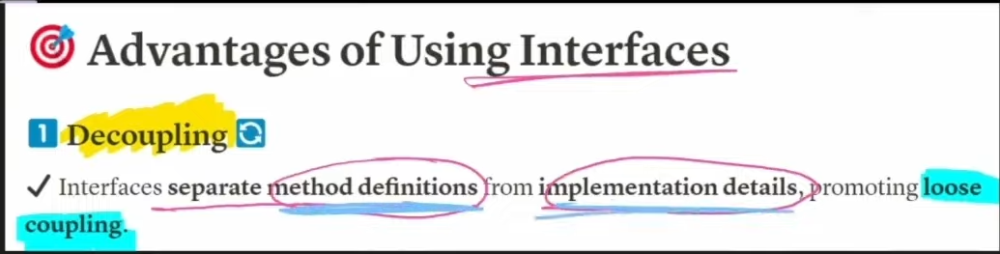


# abstract class vs interface

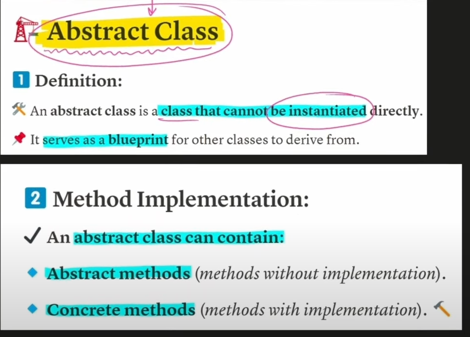
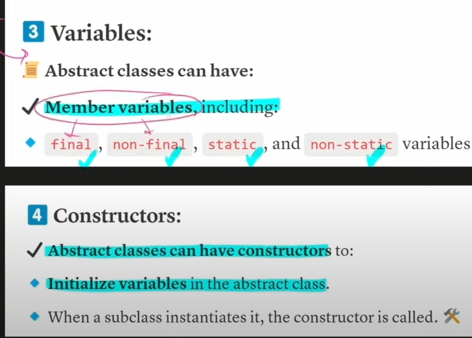

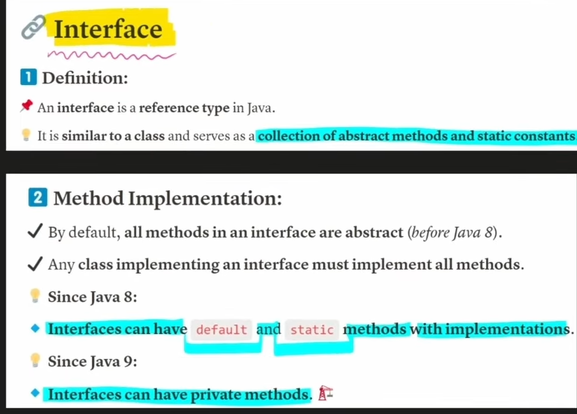
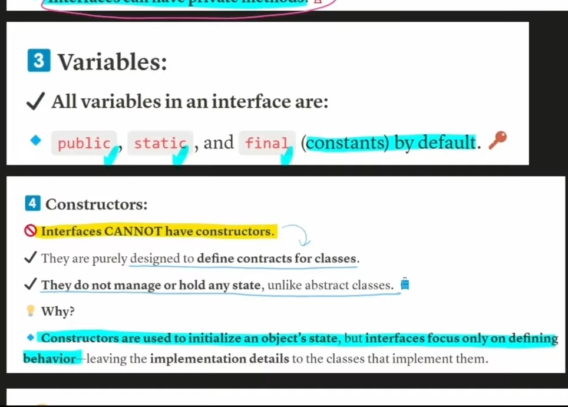

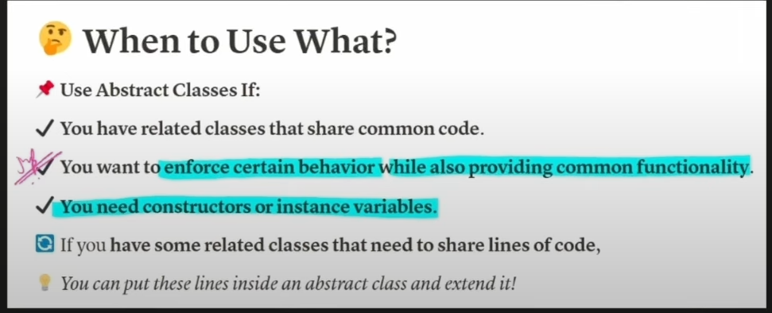
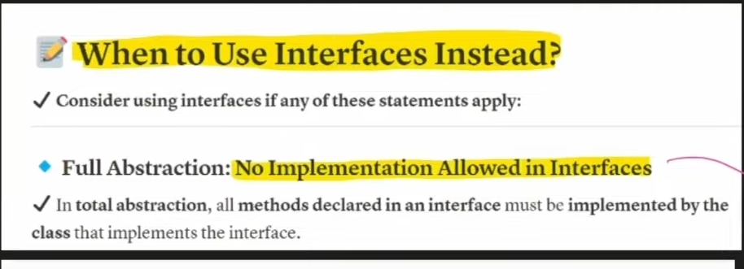
### when to use abstraction
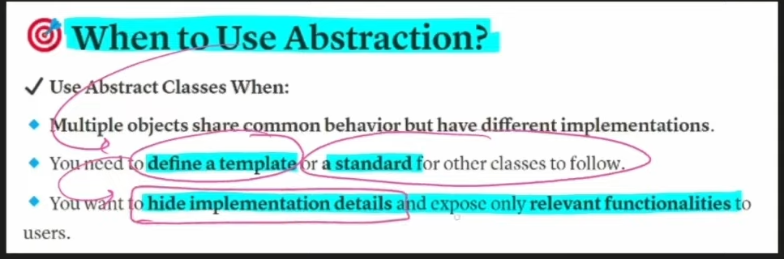

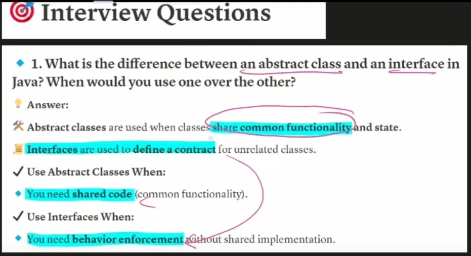

- q  can an abstract class implement an interface?
  - Use this when you want to share common code among multiple classes that implement the interface, but still force subclasses to define their own behavior for certain methods.

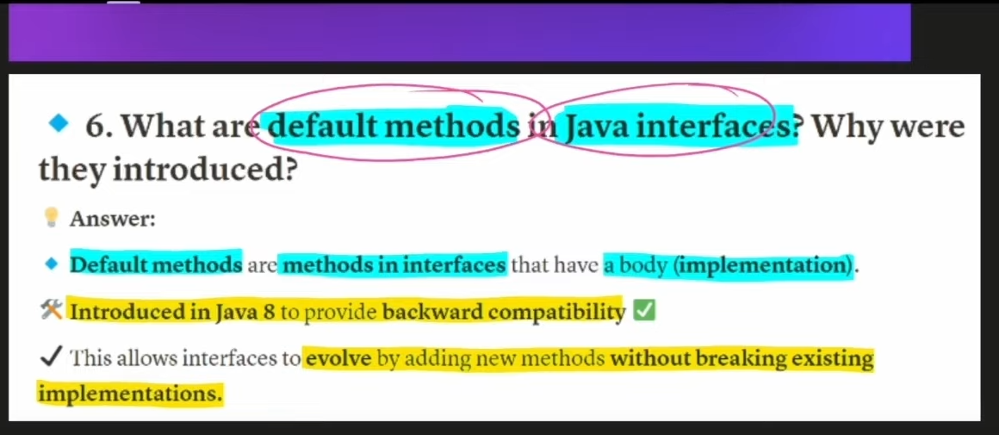
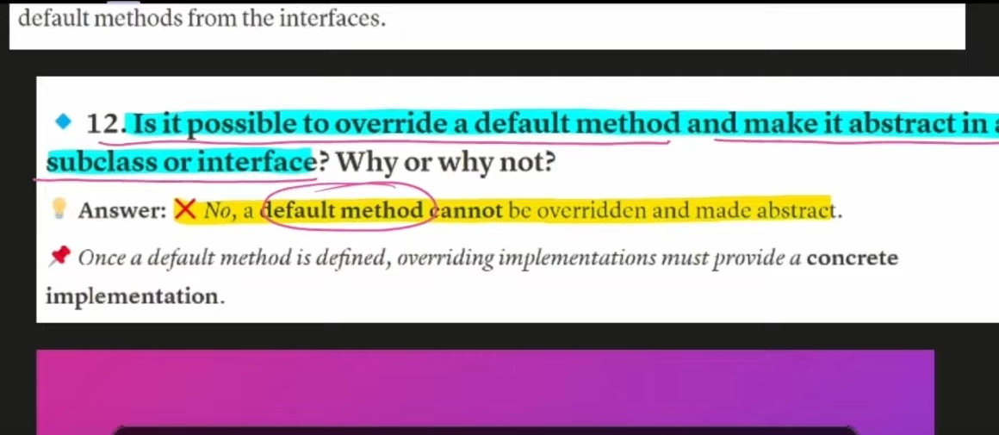
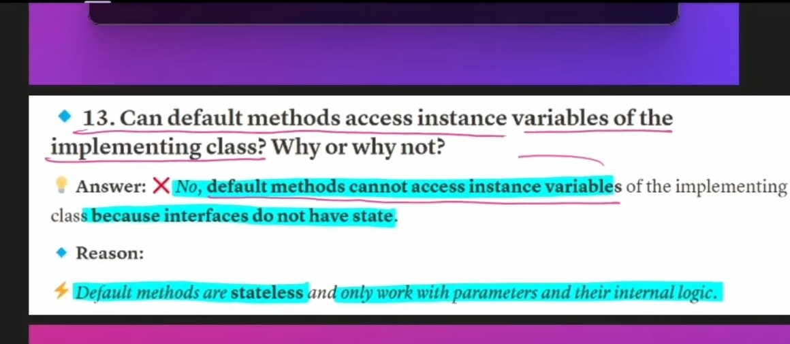